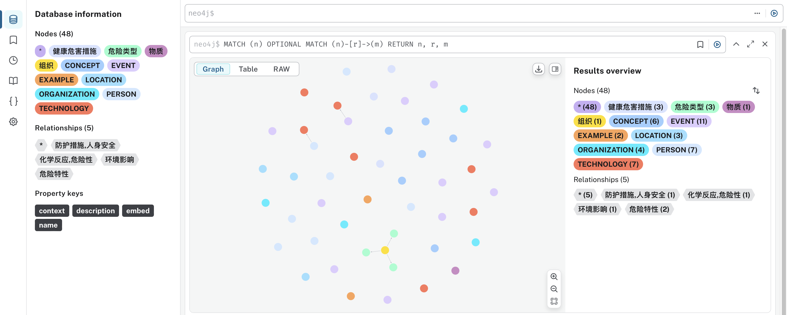

# msds-qa

## msds知识问答系统

Q：从知识库中查询氢化钙会造成哪些健康危害

ToolMessage:

1. 氢化钙可能对环境产生毒性影响。
2. 氢化钙对黏膜、呼吸道、眼和皮肤具有强烈刺激性，对人体有害。
3. 氢化钙遇湿易燃，具备潜在风险特性。

A：氢化钙的健康危害包括其对黏膜、呼吸道、眼和皮肤的强烈刺激性，可能导致人体伤害。储存设备需遵守严格的安全标准，同时氢化钙可能对人体和环境产生毒性影响，需要按照相关标准进行存储和操作。